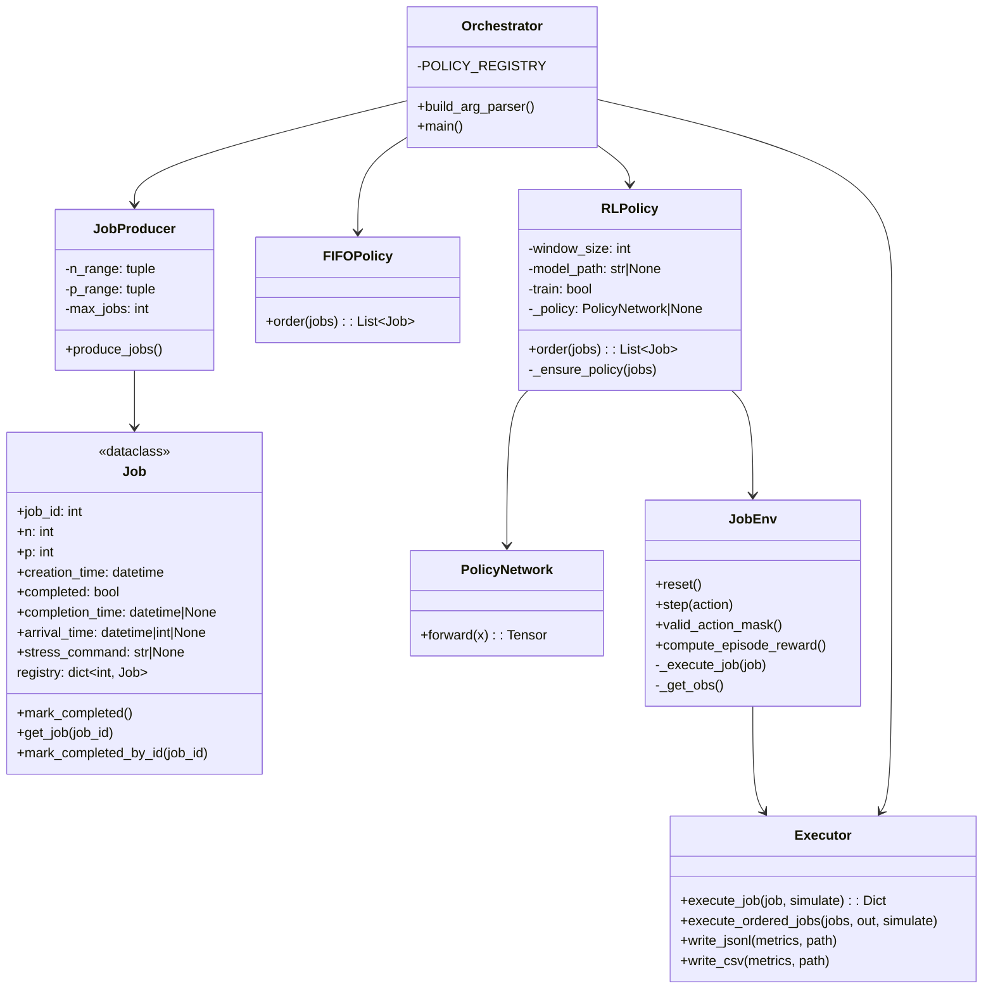
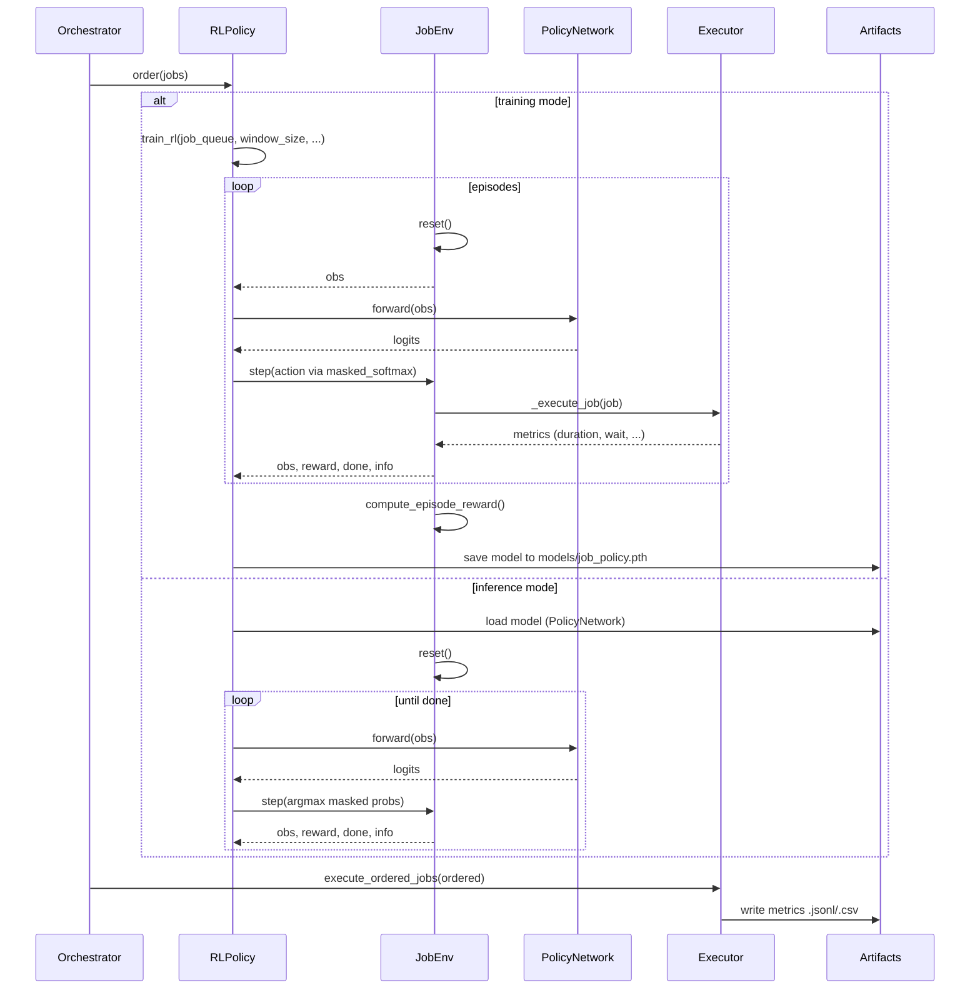

## NAI Project — Architecture and Flows

This document provides high-level flow and system design diagrams for the current implementation. Diagrams use Mermaid for easy visualization.

### Overall Job Orchestration Flow

```mermaid
flowchart TD
    U[User / CLI]
    subgraph Orchestrator
        O1[orchestrator.py\nparse args]
        O2[JobProducer.produce_jobs\ncreates Job instances\nregisters in Job.registry]
        O3[Select Policy\nfifo | rl]
        O4[policy.order(jobs)]
        O5[execute_ordered_jobs]
    end

    subgraph Scheduler
        S1[FIFO policy]
        S2[RLPolicy\nloads/trains PolicyNetwork\nuses JobEnv]
    end

    subgraph Executor
        E1[execute_job(job, simulate)]
        E2[write_jsonl/csv]
    end

    U --> O1 --> O2 --> O3
    O3 -->|fifo| S1 --> O4
    O3 -->|rl| S2 --> O4
    O4 --> O5 --> E1 --> E2
```

Key points:

- Jobs are generated by `jobs/producer.py` and auto-registered in `Job.registry` via `jobs/job.py`.
- The orchestrator selects a policy: FIFO or RL. RL can either train a new model or load a saved one.
- Ordered jobs are executed by `executor/executor.py`, which simulates or invokes `stress-ng`, and writes metrics to `artifacts/`.

### Component/System Design



Notes:

- `Job.arrival_time` is currently set to `-1` in the producer as a placeholder; the executor records actual timestamps for `start_time` and `end_time` and computes `queue_wait_s` from `creation_time`.
- `Executor.execute_job` decides between simulation and real `stress-ng` execution and returns structured metrics consumed by both training and final reporting.

### RL Scheduling Flow (Training and Inference)



### System Block Diagram (Boxed Components)

```mermaid
flowchart LR
    classDef comp fill:#E8F0FE,stroke:#3B82F6,color:#1F2937,stroke-width:1px
    classDef proc fill:#ECFDF5,stroke:#10B981,color:#065F46,stroke-width:1px
    classDef store fill:#FEF3C7,stroke:#F59E0B,color:#7C2D12,stroke-width:1px
    classDef ext fill:#F3F4F6,stroke:#6B7280,color:#111827,stroke-width:1px

    U[User / CLI]:::ext

    subgraph ORC[Orchestrator]
        O1[Args & Config]:::comp
        O2[JobProducer]:::comp
        O3[Policy Selector]:::comp
    end

    subgraph SCH[Scheduler]
        F1[FIFO Policy]:::proc
        R1[RLPolicy]:::proc
        subgraph RL[RL Components]
            N1[PolicyNetwork]:::proc
            E1[JobEnv]:::proc
        end
    end

    subgraph EXE[Executor]
        X1[execute_job]:::proc
        X2[execute_ordered_jobs]:::proc
    end

    subgraph ART[Artifacts]
        A1[metrics_*.jsonl]:::store
        A2[metrics_*.csv]:::store
        A3[models/job_policy.pth]:::store
        A4[runs/* (TensorBoard)]:::store
    end

    U --> ORC
    O1 --> O2 --> O3
    O3 -->|fifo| F1
    O3 -->|rl| R1 --> N1
    R1 --> E1
    F1 --> X2
    R1 --> X2
    X2 --> X1 --> ART
    N1 -.uses obs/mask .-> E1
```

### Data Artifacts

- Metrics are written to `artifacts/metrics_*.jsonl` and `artifacts/metrics_*.csv`.
- TensorBoard logs are written under `runs/` during training.
- Saved model lives in `models/job_policy.pth`.

### Execution Modes

- FIFO: Sort by `(creation_time, job_id)` and execute.
- RL: Uses `JobEnv` with masked actions and episode reward to prefer schedules optimizing throughput and wait time.
